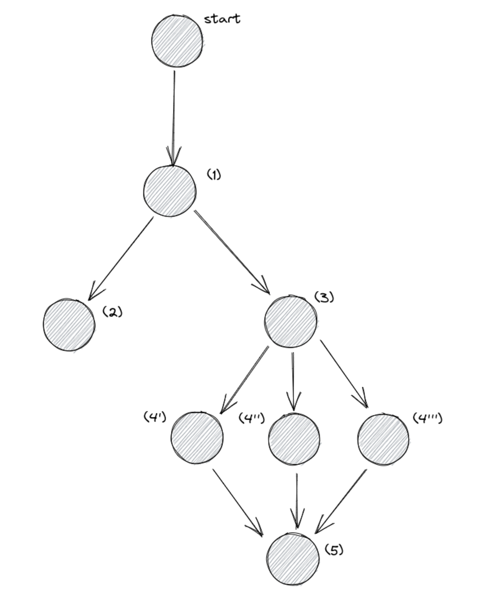

# Content

Ce projet a pour but la mise en place d'un DAG qui permet de récupérer des informations depuis une API de données météo disponible en [ligne](https://openweathermap.org/appid), les stocke, les transforme et entraîne un algorithme dessus. Son architecture sera la suivante

La première tâche (1) consiste donc en la récupération des données depuis [OpenWeatherMap]((https://openweathermap.org/appid)) : on pourra faire plusieurs
requêtes pour avoir les données sur plusieurs villes. Pour cela, on stockera une Variable nommée cities. Dans notre solution, nous utilisons,['paris', 'london', 'washington'] mais vous pouvez choisir d'autres villes.
Cette tâche doit stocker les données au format json dans un fichier dont le nom correspond à l'heure et la date de la récolte de donnée : 2021-01-01 00:00.json. Ce fichier devra être créé dans le dossier /app/raw_files.
On pourra utiliser les librairies requests et json. (2) et (3) transformation des données Les tâches (2) et (3) consiste à lire le contenu du dossier /app/raw_files et transformer les données au format csv. (4) et (5) entraînement de modèles et sélection du plus performant. Les tâches (4'), (4'') et (4''') correspondent à l'entraînement de différents modèles de régression (respectivement LinearRegression, DecisionTreeRegressor, RandomForestRegressor).
(5) Une fois ces modèles entraînés et testés avec une méthode de validation croisée, on pourra utiliser un XCom pour transmettre la valeur du score de validation. (6) La tâche (5) permettra de choisir le meilleur modèle, de le ré-entraîner sur toutes les données et de le sauvegarder.